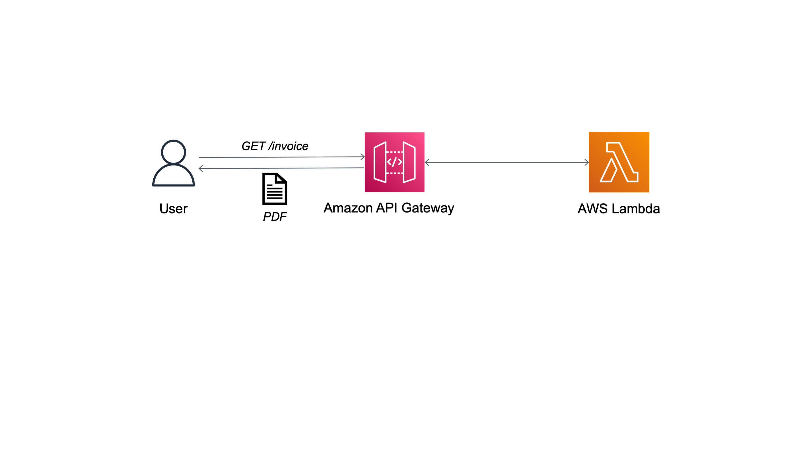

# Porting a containerized application to AWS Lambda

This is the source code accompanying blog post for porting a containerized application to [AWS Lambda](https://aws.amazon.com/lambda) with container image support. It demonstrates the changes needed to development, packaging, and deployment workflows to make an existing containerized application compatible with Lambda . For teams pressed for time, this accelerates the adoption of Serverless by leveraging container domain knowledge and promoting reuse of existing tooling.

## Solution Overview

The sample application is a simple Ruby [Sinatra](https://github.com/sinatra/sinatra) web service to generate PDF invoices using the [invoice_printer](https://github.com/strzibny/invoice_printer) gem. In a real-world scenario, the order and customer details for the invoice would be passed as POST request body or GET request query string parameters. We are keeping it simple for the sake of the demo since the focus is to show porting the application.



## Instructions for porting the application

We will cover the instructions needed to follow the blog recommendations.

1. Building and testing container image for existing application locally
2. Building and testing Lambda container image locally
3. Creating and testing Lambda function on AWS

### Prerequisites

All commands are executed from the root folder of this repository. It is recommended to set your region and account as environment variables as you will use them for almost all commands. Replace the region and account to the ones you are using.

```shell
export AWS_REGION=region
export AWS_ACCOUNT_ID=account
```

### 1. Building and testing container image

The `Dockerfile` defines instructions for assembling the image for the application. Build the image using the command below.

```shell
docker build -t ruby-invoice-generator .
```

You can test this image locally using the `docker run` command.

```shell
docker run -p 4567:4567 ruby-invoice-generator
```

The application uses hard coded values to generate the invoice. In a real-world scenario, the invoice microservice will look up a database or invoke other microservices to retrieve order and customer details. To keep things simple, we have defined order and customer details directly in `lib/utils.rb`. Open another terminal window and test invoice creation using the command below.

```shell
curl "http://localhost:4567/invoice" \
  --output invoice.pdf \
  --header 'Accept: application/pdf'
```

Use CTRL+C to stop the container.

### 2. Building and testing Lambda container image

The instruction to build the image for Lambda is similar to step 1. Only you will use the file `Dockerfile.lambda` instead.

```shell
docker build -f Dockerfile.lambda -t lambda-ruby-invoice-generator .
```

We will need the [runtime interface emulator](https://github.com/aws/aws-lambda-runtime-interface-emulator/) in order to test locally. Here is the installation command for Linux platforms.

```shell
mkdir -p ~/.aws-lambda-rie && curl -Lo ~/.aws-lambda-rie/aws-lambda-rie https://github.com/aws/aws-lambda-runtime-interface-emulator/releases/latest/download/aws-lambda-rie && chmod +x ~/.aws-lambda-rie/aws-lambda-rie
```

The run command will now look as follows.

```shell
docker run \
  -v ~/.aws-lambda-rie:/aws-lambda \
  -p 9000:8080 \
  -e LOG_LEVEL=DEBUG \
  --entrypoint /aws-lambda/aws-lambda-rie \
  lambda-ruby-invoice-generator \
  /opt/bitnami/ruby/bin/aws_lambda_ric function.Billing::InvoiceGenerator.process
```

Run the command below on a different terminal tab to simulate a Lambda request.

```shell
curl -XPOST "http://localhost:9000/2015-03-31/functions/function/invocations" -d '{}'
```

You will see a JSON output with the base64 encoded value of the invoice for body and `isBase64Encoded` flag set to true. Once Lambda is integrated with API Gateway, the HTTP API endpoint uses the flag to decode the text before returning the response to the caller. The API client will receive the decoded PDF invoice. Use CTRL+C to stop the container.

### 3. Creating and testing Lambda function on AWS

You will have to upload the docker image for Lambda to [Amazon Elastic Container Registry](https://aws.amazon.com/ecr/) (ECR) first.

```shell
ECR_REPOSITORY=`aws ecr create-repository \
  --region $AWS_REGION \
  --repository-name lambda-ruby-invoice-generator \
  --tags Key=Project,Value=lambda-ruby-invoice-generator-blog \
  --query "repository.repositoryName" \
  --output text`
```

You must login to ECR before you can push the image.

```shell
aws ecr get-login-password \
  --region $AWS_REGION | docker login \
  --username AWS \
  --password-stdin $AWS_ACCOUNT_ID.dkr.ecr.$AWS_REGION.amazonaws.com
```

Tag and push the image to ECR.

```shell
docker tag \
  lambda-ruby-invoice-generator:latest \
  $AWS_ACCOUNT_ID.dkr.ecr.$AWS_REGION.amazonaws.com/$ECR_REPOSITORY:latest

docker push $AWS_ACCOUNT_ID.dkr.ecr.$AWS_REGION.amazonaws.com/$ECR_REPOSITORY:latest
```

Once the push succeeds, you can create the Lambda function. You will need a Lambda execution role.

```shell
LAMBDA_ROLE=`aws iam create-role \
  --region $AWS_REGION \
  --role-name ruby-invoice-generator-lambda-role \
  --assume-role-policy-document file://lambda-role-trust-policy.json \
  --tags Key=Project,Value=lambda-ruby-invoice-generator-blog \
  --query "Role.Arn" \
  --output text`

aws iam attach-role-policy \
  --region $AWS_REGION \
  --role-name ruby-invoice-generator-lambda-role \
  --policy-arn arn:aws:iam::aws:policy/service-role/AWSLambdaBasicExecutionRole

LAMBDA_ARN=`aws lambda create-function \
  --region $AWS_REGION \
  --function-name ruby-invoice-generator \
  --description "[AWS Blog] Lambda Ruby Invoice Generator" \
  --role $LAMBDA_ROLE \
  --package-type Image \
  --code ImageUri=$AWS_ACCOUNT_ID.dkr.ecr.$AWS_REGION.amazonaws.com/$ECR_REPOSITORY:latest \
  --timeout 15 \
  --memory-size 256 \
  --tags Project=lambda-ruby-invoice-generator-blog \
  --query "FunctionArn" \
  --output text`
```

If you see the error "`An error occurred (InvalidParameterValueException) when calling the CreateFunction operation: The role defined for the function cannot be assumed by Lambda.`" for the create-function command above, retry after a few seconds.

You must wait for the function to be ready. Use the command to verify function State is set to Active.

```shell
aws lambda get-function \
  --region $AWS_REGION \
  --function-name ruby-invoice-generator \
  --query "Configuration.State"
```

The final step is to create a HTTP API and integrate it with the Lambda function.

```shell
aws apigatewayv2 create-api \
  --region $AWS_REGION \
  --name invoice-generator-api \
  --protocol-type HTTP \
  --target $LAMBDA_ARN \
  --route-key "GET /invoice" \
  --tags Key=Project,Value=lambda-ruby-invoice-generator-blog \
  --query "{ApiEndpoint: ApiEndpoint, ApiId: ApiId}" \
  --output json
```

Note down the ApiEndpoint and ApiId. We need to update the Lambda resource policy to allow HTTP API to invoke it. You can set them as environment variables.

```shell
export API_ENDPOINT="<ApiEndpoint>"
export API_ID="<ApiId>"

aws lambda add-permission \
  --region $AWS_REGION \
  --statement-id invoice-generator-api \
  --action lambda:InvokeFunction \
  --function-name $LAMBDA_ARN \
  --principal apigateway.amazonaws.com \
  --source-arn "arn:aws:execute-api:$AWS_REGION:$AWS_ACCOUNT_ID:$API_ID/*/*/invoice"
```

You can test the invoice generator microservice using the curl command below. This creates the file `lambda-invoice.pdf` in the local folder. You can also test directly from a browser

```shell
curl "$API_ENDPOINT/invoice" \
  --output lambda-invoice.pdf \
  --header 'Accept: application/pdf'
```

## Cleanup instructions

To avoid incurring future charges, delete the resources.

1. Delete the HTTP API.

```shell
aws apigatewayv2 delete-api \
  --region $AWS_REGION \
  --api-id $API_ID
```

2. Delete the Lambda function and its CloudWatch log group.

```shell
aws lambda delete-function \
  --region $AWS_REGION \
  --function-name ruby-invoice-generator

for log_group in $(aws logs describe-log-groups --region $AWS_REGION --log-group-name-prefix '/aws/lambda/ruby-invoice-generator' --query "logGroups[*].logGroupName" --output text); do
  echo "Removing log group ${log_group}..."
  aws logs delete-log-group --log-group-name ${log_group}
  echo
done
```

3. Delete the Lambda execution role.

```shell
aws iam detach-role-policy \
  --region $AWS_REGION \
  --role-name ruby-invoice-generator-lambda-role \
  --policy-arn arn:aws:iam::aws:policy/service-role/AWSLambdaBasicExecutionRole

aws iam delete-role \
  --region $AWS_REGION \
  --role-name ruby-invoice-generator-lambda-role
```

4. Delete the ECR repository.

```shell
aws ecr batch-delete-image \
    --region $AWS_REGION \
    --repository-name $ECR_REPOSITORY \
    --image-ids imageTag=latest

aws ecr delete-repository \
  --region $AWS_REGION \
  --repository-name $ECR_REPOSITORY
```
